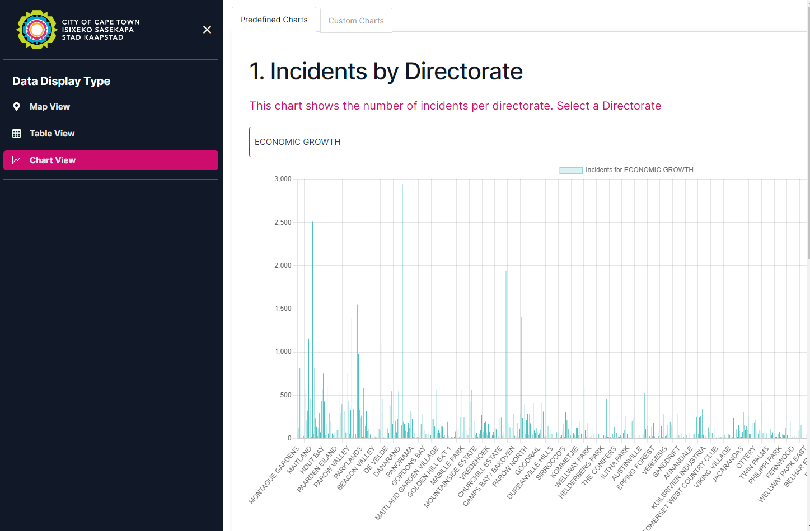

# Project Overview	

# Live Example
### Dashboard
- http://cct.zwivhu.dev

### API Swagger Documentation
-  http://api-cct.zwivhu.dev/swagger

______

# Introduction

The project includes two main folders:	

## 1. PythonApp
- This folder contains task 2, which is a Python project designed to merge `city-hex-polygons-8.geojson` with a service request file.	
- For detailed information and instructions, please refer to the README file located at [PythonApp/README.md](PythonApp).	

## 2.  VueApp
- This folder contains part of task 6, which is a Vue app project designed to view `sr_hex.csv` with through an interactive single page application.	
- For detailed information and instructions, please refer to the README file located at [VueApp/README.md](VueApp).
- Link to [VueApp/data-driven-storytelling.md](VueApp/data-driven-storytelling.md) describing the data storytelling.
- Link to [VueApp/visualisation-design-choices.md](VueApp/visualisation-design-choices.md) describing choices made in the visualisation design.

## 3. NodeApp
- This folder contains part of task 6, which is a NodeJs Express API project designed to serve VueApp
- For detailed information and instructions, please refer to the README file located at [NodeApp/README.md](NodeApp). 

#Screenshots
## 1. Table Veiw 

## 2. Chart View
